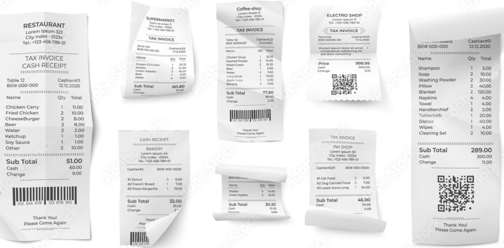

# Expense Tracker for Shopping Receipts

This application is designed to track expenses easily from various shopping receipts using OpenCV and Tesseract OCR. It processes images of receipts, extracts relevant information (items, prices, quantities), and provides visualizations for better insights into spending habits.

## Features

- **Image Processing with OpenCV**: Preprocesses receipt images to enhance OCR accuracy.
- **Text Extraction with Tesseract OCR**: Extracts text from processed images to capture items, quantities, and prices.
- **Data Aggregation**: Merges data from multiple receipts into a single CSV file.
- **Dynamic Visualizations**: Uses Plotly to provide interactive visualizations, such as bar charts and pie charts, for a better understanding of expenses.
- **Support for Multiple Receipts**: Can handle multiple receipt formats and layouts.

## Installation

To run this project locally, follow these steps:

1. **Clone the repository:**
   ```bash
   git clone https://github.com/srimalonline/expense-tacker-for-shopping-receipts.git
   cd expense-tacker-for-shopping-receipts
   ```

2. **Install the required dependencies:**
   Ensure you have Python installed (version 3.12 or higher). Then install the necessary Python packages using pip:
   ```bash
   pip install opencv-python pytesseract pandas plotly
   ```

3. **Install Tesseract-OCR:**
   - **Windows**: [Download from here](https://github.com/tesseract-ocr/tesseract/wiki)
   - **Ubuntu**: 
     ```bash
     sudo apt-get install tesseract-ocr
     ```
   - **Mac**:
     ```bash
     brew install tesseract
     ```

4. **Set the Tesseract OCR Path:**
   Before running the `shoper.py` script, make sure to set the path to the Tesseract executable in the script. Open `shoper.py` and update the line:
   ```python
   pytesseract.pytesseract.tesseract_cmd = r'C:\Program Files\Tesseract-OCR\tesseract'  # Update this path
   ```

## Usage

1. **Run `shoper.py` to Process Receipts:**
   This script processes receipt images and extracts text data using OCR.
   ```bash
   python shoper.py <path_to_receipt_image>
   ```

2. **Run `infovis.py` to Visualize Data:**
   This script merges the extracted data into a CSV and generates visualizations.
   ```bash
   python infovis.py
   ```

3. **Run `infovis-advance.py` for Dynamic Visualizations:**
   This script uses Plotly to create dynamic, interactive visualizations.
   ```bash
   python infovis-advance.py
   ```

## Dependencies

- **Python 3.6+**
- **OpenCV**: For image processing.
- **Tesseract OCR**: For text extraction.
- **Pandas**: For data manipulation and aggregation.
- **Plotly**: For interactive visualizations.

## Example Output

### Receipt Processing Example



### Visualizations

1. **Total Quantity Sold per Item** (Bar Chart)
2. **Total Sales Amount per Item** (Horizontal Bar Chart)
3. **Top N Items by Quantity Sold** (Pie Chart)

## Acknowledgements

- **OpenCV**: For powerful image processing capabilities.
- **Tesseract OCR**: For reliable text extraction from images.
- **Plotly**: For dynamic and interactive visualizations.
- **Python Community**: For providing excellent libraries and documentation.
## Contributing

Contributions are welcome! Please follow these steps:

1. Fork the repository.
2. Create a new branch (`git checkout -b feature-branch`).
3. Commit your changes (`git commit -m 'Add some feature'`).
4. Push to the branch (`git push origin feature-branch`).
5. Open a pull request.
Feel free to explore, use, and contribute to the project!
